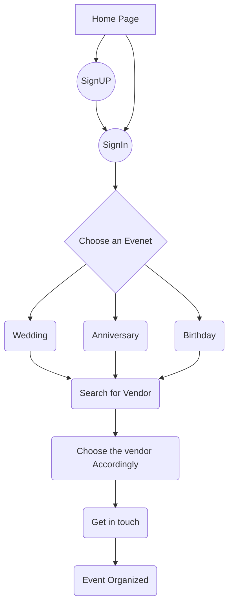
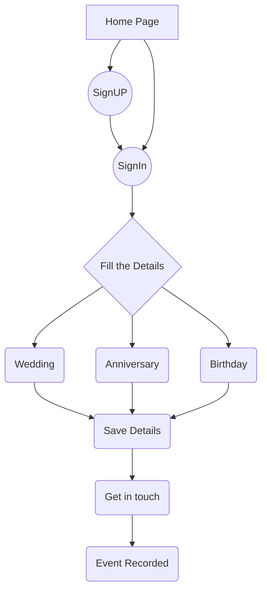

## “The purpose of event management is to create a client who creates other clients.”

UTSAV is an event management company for planning events involving grand weddings, lavish anniversaries and birthdays.

## Type of Users

Vendors     : The one who wants to be the organizer and offers goods

Customers   : The one who is interested in taking the benefits of goods

## Flow of the Website

1.  Customer Point of View

2.  Vendor Point of View

## SUMMARY

UTSAV - FULL STACK PROJECT (HTML, CSS, Javascript, NodeJS, Bootstrap, jQuery, Angular,js, SQL):
◦ It is an event planning website where we may find vendors providing various services in any region of the country, as well as a 
list of vendors and the services provided by them.

◦ Used NodeMailer in NodeJS for sending and receiving mails.

◦ Used MySQL and NodeJS for handling backend queries.
