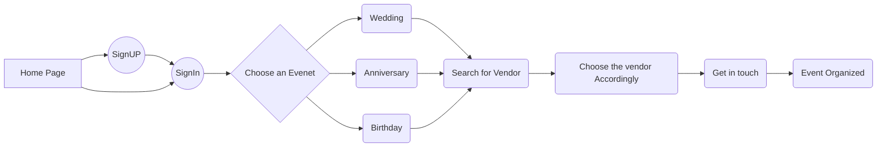

# Utsav

UTSAV is an event management company for planning events involving grand weddings, lavish anniversaries and birthdays.

## Type of Users
Vendors     : The one who wants to be the organizer and offers goods
Customers : The one who is interested in taking the benefits of goods

## Flow of the Website

1.  Customer Point of View


2.  Vendor Point of View
```mermaid
graph LR
A[Home Page] --> B((SignUP))
B-->C
A --> C((SignIn))
C --> D{Fill the Details}
D-->E(Wedding)
D-->F(Anniversary)
D-->G(Birthday)
E-->H(Save Details)
F-->H(Save Details)
G-->H(Save Details)
H-->J(Get in touch)
J-->K(Event Recorded)
